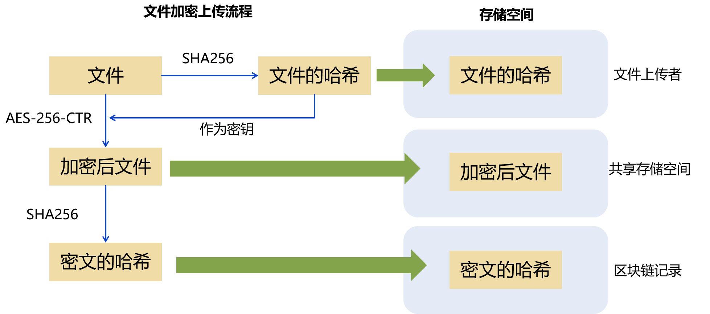

# SimpleBlockChain
一个Python写的简单区块链应用。

## 上传过程
1. 用户在上传数据之前，可以获取整个区块链上**已有的所有数据**经自身哈希值加密后，得到的密文数据的哈希值，通过比较这些数据与自己数据对应的**哈希值**，判断是否存在重复数据。
2. 一个用户如果要把自己的数据上传，则需要进行挖矿操作，获得区块发布权，这里仍然是POW。
3. 用户只上传不重复的数据。上传数据的流程是发布一个区块，**同时**把加密后的数据上传到共享的存储空间中。同时区块链记录**上传者**的信息，之后只有上传者可以下载该文件。

> 上传的数据已经完成加密。加密的方式是：以**文件本身的哈希值**为秘钥进行加密后的密文

4. 用户在本地存储着**数据的哈希值**，该哈希值作为解密文件的秘钥存在。

## 安全性分析

- 如果恶意用户尝试通过短哈希攻击获取所有权，需要浪费大量的算力，即使攻击成功，也不影响安全性，见下。
- 如果恶意用户没有源文件，则无法获知文件的哈希，得到密文也无法获得数据。通过该策略保证了数据安全性。

## 参考文献

[1]Zhang, Bo, et al. "Enabling secure deduplication in encrypted decentralized storage." *International Conference on Network and System Security*. Cham: Springer Nature Switzerland, 2022.
